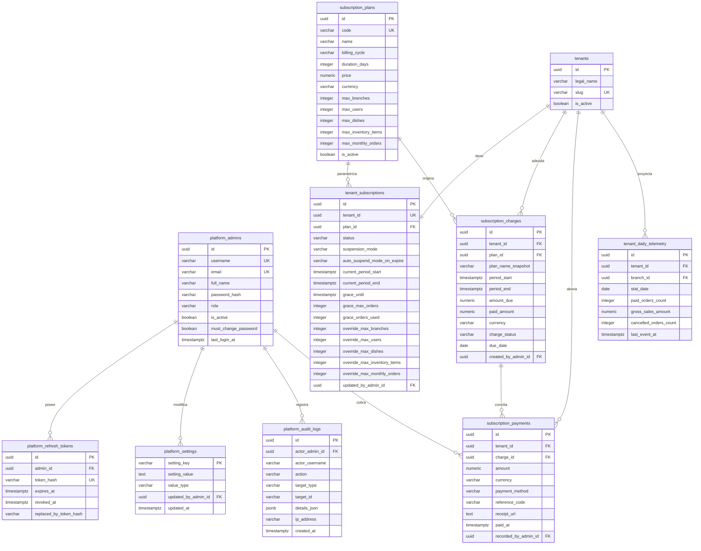

# Modelo de Dominio y ERD Plataforma Backoffice (`V17`, `V18`, `V19`)

> ⬅️ [Volver al Índice Backoffice](../README.md) | [Esquema Detallado](../sdd/03_backoffice_database_schema.md)

```mermaid
erDiagram
    platform_admins {
        uuid id PK
        varchar username UK
        varchar email UK
        varchar full_name
        varchar password_hash
        varchar role
        boolean is_active
        boolean must_change_password
        timestamptz last_login_at
    }

    platform_refresh_tokens {
        uuid id PK
        uuid admin_id FK
        varchar token_hash UK
        timestamptz expires_at
        timestamptz revoked_at
        varchar replaced_by_token_hash
    }

    platform_settings {
        varchar setting_key PK
        text setting_value
        varchar value_type
        uuid updated_by_admin_id FK
        timestamptz updated_at
    }

    tenants {
        uuid id PK
        varchar legal_name
        varchar slug UK
        boolean is_active
    }

    subscription_plans {
        uuid id PK
        varchar code UK
        varchar name
        varchar billing_cycle
        integer duration_days
        numeric price
        varchar currency
        integer max_branches
        integer max_users
        integer max_dishes
        integer max_inventory_items
        integer max_monthly_orders
        boolean is_active
    }

    tenant_subscriptions {
        uuid id PK
        uuid tenant_id UK
        uuid plan_id FK
        varchar status
        varchar suspension_mode
        varchar auto_suspend_mode_on_expire
        timestamptz current_period_start
        timestamptz current_period_end
        timestamptz grace_until
        integer grace_max_orders
        integer grace_orders_used
        integer override_max_branches
        integer override_max_users
        integer override_max_dishes
        integer override_max_inventory_items
        integer override_max_monthly_orders
        uuid updated_by_admin_id FK
    }

    subscription_charges {
        uuid id PK
        uuid tenant_id FK
        uuid plan_id FK
        varchar plan_name_snapshot
        timestamptz period_start
        timestamptz period_end
        numeric amount_due
        numeric paid_amount
        varchar currency
        varchar charge_status
        date due_date
        uuid created_by_admin_id FK
    }

    subscription_payments {
        uuid id PK
        uuid tenant_id FK
        uuid charge_id FK
        numeric amount
        varchar currency
        varchar payment_method
        varchar reference_code
        text receipt_url
        timestamptz paid_at
        uuid recorded_by_admin_id FK
    }

    tenant_daily_telemetry {
        uuid id PK
        uuid tenant_id FK
        uuid branch_id FK
        date stat_date
        integer paid_orders_count
        numeric gross_sales_amount
        integer cancelled_orders_count
        timestamptz last_event_at
    }

    platform_audit_logs {
        uuid id PK
        uuid actor_admin_id FK
        varchar actor_username
        varchar action
        varchar target_type
        varchar target_id
        jsonb details_json
        varchar ip_address
        timestamptz created_at
    }

    platform_admins ||--o{ platform_refresh_tokens : "posee"
    platform_admins ||--o{ platform_settings : "modifica"
    platform_admins ||--o{ platform_audit_logs : "registra"
    platform_admins ||--o{ subscription_payments : "cobra"
    subscription_plans ||--o{ tenant_subscriptions : "parametriza"
    subscription_plans ||--o{ subscription_charges : "origina"
    tenants ||--|| tenant_subscriptions : "tiene"
    tenants ||--o{ subscription_charges : "adeuda"
    tenants ||--o{ subscription_payments : "abona"
    tenants ||--o{ tenant_daily_telemetry : "proyecta"
    subscription_charges ||--o{ subscription_payments : "concilia"
```
