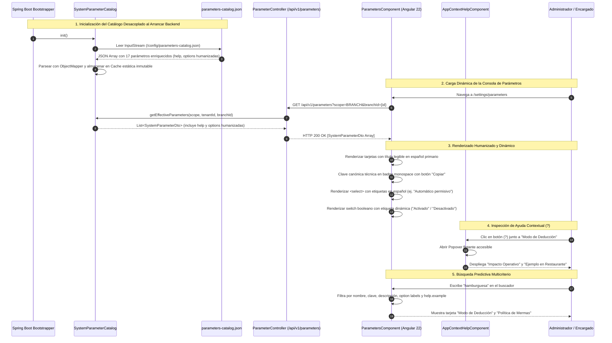

# Diagrama de Secuencia: Carga de Metadatos JSON, Humanización y Búsqueda Predictiva de Parámetros (ADR-0025 & PB-047)

```mermaid
sequenceDiagram
    autonumber
    participant App as Spring Boot Bootstrapper
    participant Cat as SystemParameterCatalog
    participant JSON as parameters-catalog.json
    participant Web as ParameterController (/api/v1/parameters)
    participant UI as ParametersComponent (Angular 22)
    participant Help as AppContextHelpComponent
    participant User as Administrador / Encargado

    Note over App,JSON: 1. Inicialización del Catálogo Desacoplado al Arrancar Backend
    App->>Cat: init()
    Cat->>JSON: Leer InputStream (/config/parameters-catalog.json)
    JSON-->>Cat: JSON Array con 17 parámetros enriquecidos (help, options humanizadas)
    Cat->>Cat: Parsear con ObjectMapper y almacenar en Cache estática inmutable

    Note over User,UI: 2. Carga Dinámica de la Consola de Parámetros
    User->>UI: Navega a /settings/parameters
    UI->>Web: GET /api/v1/parameters?scope=BRANCH&branchId={id}
    Web->>Cat: getEffectiveParameters(scope, tenantId, branchId)
    Cat-->>Web: List<SystemParameterDto> (incluye help y options humanizadas)
    Web-->>UI: HTTP 200 OK [SystemParameterDto Array]

    Note over UI,User: 3. Renderizado Humanizado y Dinámico
    UI->>UI: Renderizar tarjetas con título legible en español primario
    UI->>UI: Clave canónica técnica en badge monospace con botón "Copiar"
    UI->>UI: Renderizar <select> con etiquetas en español (ej. "Automático permisivo")
    UI->>UI: Renderizar switch booleano con etiqueta dinámica ("Activado" / "Desactivado")

    Note over User,Help: 4. Inspección de Ayuda Contextual (?)
    User->>Help: Clic en botón (?) junto a "Modo de Deducción"
    Help->>Help: Abrir Popover flotante accesible
    Help-->>User: Despliega "Impacto Operativo" y "Ejemplo en Restaurante"

    Note over User,UI: 5. Búsqueda Predictiva Multicriterio
    User->>UI: Escribe "hamburguesa" en el buscador
    UI->>UI: Filtra por nombre, clave, descripción, option labels y help.example
    UI-->>User: Muestra tarjeta "Modo de Deducción" y "Política de Mermas"
```
