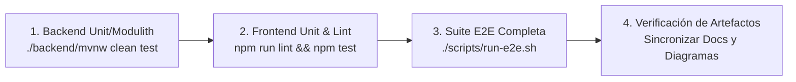

# 🧪 Inventario Maestro de Pruebas y Matriz de Regresión

Este documento es el **artefacto vivo** que inventaría la totalidad de pruebas del sistema (funcionales, transaccionales, de seguridad y de regresión). **Debe ser actualizado y ampliado cada vez que se implemente una nueva funcionalidad** en el producto.

---

## 1. Protocolo Obligatorio de Calidad (Checklist de Entrega)

Antes de dar por concluida cualquier tarea (`TASK-xxx`) o mezclar a la rama principal (`main`), es **estrictamente obligatorio** ejecutar la siguiente secuencia sin excepciones:


```mermaid
flowchart LR
    Step1["1. Backend Unit/Modulith<br/>./backend/mvnw clean test"] --> Step2["2. Frontend Unit & Lint<br/>npm run lint && npm test"]
    Step2 --> Step3["3. Suite E2E Completa<br/>./scripts/run-e2e.sh"]
    Step3 --> Step4["4. Verificación de Artefactos<br/>Sincronizar Docs y Diagramas"]
```

- [ ] **Backend 100% Verde:** `./backend/mvnw clean test` (Spring Boot + Spring Modulith verification + ArchUnit).
- [ ] **Frontend 100% Verde:** `cd frontend && npm run lint && npm test -- --watch=false` (Vitest y ESLint sin warnings).
- [ ] **Regresión E2E 100% Verde:** `./scripts/run-e2e.sh` (25/25 pruebas en Playwright pasando).
- [ ] **Inventario Actualizado:** Si la tarea agrega un nuevo flujo o altera uno existente, este documento debe reflejar el nuevo caso de prueba y su script asociado.

---

## 2. Matriz de Casos de Prueba Automatizados

| ID Caso | Módulo | Descripción / Flujo | Tipo | Automatizado | Archivo Ejecutable |
|---|---|---|---|---|---|
| **TC-AUTH-001** | Seguridad | Carga inicial, branding y formulario de login | E2E UI | ✅ Sí | `frontend/e2e/auth.spec.ts` |
| **TC-AUTH-002** | Seguridad | Alternancia de tema Claro / Oscuro (`ThemeService`) | E2E UI | ✅ Sí | `frontend/e2e/auth.spec.ts` |
| **TC-AUTH-003** | Seguridad | Redirección por rol `ADMIN_TENANT` a `/company` | E2E / RBAC | ✅ Sí | `frontend/e2e/auth.spec.ts` |
| **TC-AUTH-004** | Seguridad | Redirección por rol `CASHIER` directo al POS (`/pos`) | E2E / RBAC | ✅ Sí | `frontend/e2e/auth.spec.ts` |
| **TC-POS-001** | Ventas / POS | Indicador de conectividad En Línea y catálogo visible | E2E | ✅ Sí | `frontend/e2e/pos.spec.ts` |
| **TC-POS-002** | Ventas / POS | Adición de plato a comanda y cálculo dinámico de total | E2E | ✅ Sí | `frontend/e2e/pos.spec.ts` |
| **TC-POS-003** | Ventas / POS | Selección de modificadores y extras con recargo (`TASK-210`) | E2E / Pricing | ✅ Sí | `frontend/e2e/pos.spec.ts` |
| **TC-POS-004** | Ventas / POS | Cobro en efectivo con cálculo de cambio y emisión de ticket `T-` | E2E Transaccional | ✅ Sí | `frontend/e2e/pos.spec.ts` |
| **TC-POS-005** | Ventas / POS | Venta en Modo Offline (Dexie.js) y sincronización automática | E2E Offline-First | ✅ Sí | `frontend/e2e/pos.spec.ts` |
| **TC-FIN-001** | Finanzas | Visualización de KPIs ejecutivos de turno y saldo de caja | E2E UI | ✅ Sí | `frontend/e2e/finance.spec.ts` |
| **TC-FIN-002** | Finanzas | Desglose de estado de turno activo y fórmulas de arqueo | E2E | ✅ Sí | `frontend/e2e/finance.spec.ts` |
| **TC-FIN-003** | Finanzas | Registro de nuevo gasto de caja chica y reflejo en tabla | E2E Transaccional | ✅ Sí | `frontend/e2e/finance.spec.ts` |
| **TC-FIN-004** | Finanzas | Modal de arqueo y cálculo de diferencia en tiempo real | E2E | ✅ Sí | `frontend/e2e/finance.spec.ts` |
| **TC-INV-001** | Inventario | KPIs de insumos, valorización y alertas de stock mínimo | E2E UI | ✅ Sí | `frontend/e2e/inventory.spec.ts` |
| **TC-INV-002** | Inventario | Tabla de existencias físicas y stock actual por insumo | E2E | ✅ Sí | `frontend/e2e/inventory.spec.ts` |
| **TC-INV-003** | Inventario | Historial de auditoría en Kardex de movimientos | E2E Audit | ✅ Sí | `frontend/e2e/inventory.spec.ts` |
| **TC-INV-004** | Inventario | Ajuste físico de stock con actualización reactiva | E2E Transaccional | ✅ Sí | `frontend/e2e/inventory.spec.ts` |
| **TC-CAT-001** | Catálogo | Navegación entre pestañas Platos, Insumos y Categorías | E2E UI | ✅ Sí | `frontend/e2e/catalog.spec.ts` |
| **TC-CAT-002** | Catálogo | Listado de platos del menú con precios base | E2E | ✅ Sí | `frontend/e2e/catalog.spec.ts` |
| **TC-CAT-003** | Catálogo | Insumos base y categorías asociadas | E2E | ✅ Sí | `frontend/e2e/catalog.spec.ts` |
| **TC-ONB-001** | Onboarding / Tenant | Wizard de 3 pasos, verificación de slug, preset ciudad y alta atómica de empresa | E2E Transaccional | ✅ Sí | `scripts/e2e/run_sprint3_e2e_battery.js` |
| **TC-TOUR-001** | Onboarding / UX | Product Tour guiado interactivo post-onboarding con navegación y salto | E2E UI | ✅ Sí | `scripts/e2e/run_sprint3_e2e_battery.js` |
| **TC-CFG-001** | Configuración | Búsqueda reactiva, edición en línea y Hot-Reload de parámetros en caliente | E2E Config | ✅ Sí | `scripts/e2e/run_sprint3_e2e_battery.js` |
| **TC-RBAC-001** | Seguridad / RBAC | Alta de roles personalizados y matriz de privilegios modulares | E2E RBAC | ✅ Sí | `scripts/e2e/run_sprint3_e2e_battery.js` |
| **TC-MOB-001** | Ventas / POS Móvil | Viewport smartphone (390px), lista compacta, barra flotante inferior y Bottom Sheet | E2E Touch UX | ✅ Sí | `scripts/e2e/run_sprint3_e2e_battery.js` |
| **TC-MOB-002** | Inventario Móvil | Ocultamiento de tabla, tarjetas apilables con acordeón expandible y bordes de estado | E2E Touch UX | ✅ Sí | `scripts/e2e/run_sprint3_e2e_battery.js` |
| **TC-AUTH-005** | Seguridad / Sesiones | Login calificado, emisión de tokens duales y renovación silenciosa (Silent Refresh) | E2E Seguridad | ✅ Sí | `scripts/e2e/run_sprint3_e2e_battery.js` |
| **TC-FLOW-001** | End-to-End | 1. Apertura o verificación de turno con fondo inicial (Cajero) | E2E Jornada | ✅ Sí | `frontend/e2e/shift-lifecycle.spec.ts` |
| **TC-FLOW-002** | End-to-End | 2. Venta POS multilínea con extras, Happy Hour y ticket | E2E Jornada | ✅ Sí | `frontend/e2e/shift-lifecycle.spec.ts` |
| **TC-FLOW-003** | End-to-End | 3. Solicitud de gastos en gaveta (Cajero) con estado Pendiente | E2E Jornada | ✅ Sí | `frontend/e2e/shift-lifecycle.spec.ts` |
| **TC-FLOW-004** | End-to-End | 4. Autorización y aprobación de gastos pendientes (Admin) | E2E Jornada | ✅ Sí | `frontend/e2e/shift-lifecycle.spec.ts` |
| **TC-FLOW-005** | End-to-End | 5. Arqueo físico de gaveta, cuadre exacto y cierre de jornada | E2E Jornada | ✅ Sí | `frontend/e2e/shift-lifecycle.spec.ts` |
| **TC-POS-006** | Ventas / POS | Invariante de turno en backend (HTTP 409 Conflict RFC 7807 SHIFT_REQUIRED_ERROR) | Integración / API | ✅ Sí | `backend/src/test/java/com/restaurant/app/modules/pos/internal/PosIntegrationTest.java` |
| **TC-FIN-005** | Finanzas | Apertura de turno con política SUPERVISOR_ONLY (`finance:shifts_supervisor`) | Integración / RBAC | ✅ Sí | `backend/src/test/java/com/restaurant/app/modules/finance/internal/CashShiftServiceTest.java` |
| **TC-FIN-006** | Finanzas | Validación de techo máximo de gastos de caja menor (100.00 Bs.) pagados desde gaveta | Integración / Regla | ✅ Sí | `backend/src/test/java/com/restaurant/app/modules/finance/internal/CashShiftServiceTest.java` |
| **TC-FIN-007** | Finanzas | Política de control dual en autoaprobación de gastos (`finance.expense_allow_self_approval`) | Integración / RBAC | ✅ Sí | `backend/src/test/java/com/restaurant/app/modules/finance/internal/CashShiftServiceTest.java` |
| **TC-POS-007** | Ventas / POS | Bloqueo reactivo de interfaz POS ante caja cerrada y banner accesible con CTA | Unitario / UI | ✅ Sí | `frontend/src/app/features/pos/pos.component.spec.ts` |
| **TC-POS-008** | Ventas / POS Móvil | Ergonomía silenciosa de Dexie en móviles y despliegue condicional de barra ámbar offline | Unitario / UX Móvil | ✅ Sí | `frontend/src/app/features/pos/pos.component.spec.ts` |
| **TC-POS-009** | Ventas / POS | Trazabilidad de cajero activo en comprobante visual de comanda | Unitario / UI | ✅ Sí | `frontend/src/app/features/pos/pos.component.spec.ts` |
| **TC-UIKIT-001** | Design System / UI Kit | Motor de Temas en Caliente (`ThemeService`): cambio instantáneo de `surfacePreset`, `brandPalette` y colapso de Sidebar (`mini-rail` / `full-hide`) | Unit / Vitest | ✅ Sí | `frontend/src/app/core/services/theme.service.spec.ts` |
| **TC-UIKIT-002** | Design System / UI Kit | Suite de 8 Componentes Standalone (`<app-icon>`, `<app-button>`, `<app-badge>`, `<app-form-field>`, `<app-modal>`, `<app-toast-portal>`) | Unit / Vitest | ✅ Sí | `frontend/src/app/shared/components/ui/ui-kit.spec.ts` |
| **TC-UIKIT-003** | Notificaciones / RFC 7807 | Cola reactiva de Toasts en `z-[9999]`, deduplicación e integración automática con `errorInterceptor` sobre modales activos | Unit / Vitest | ✅ Sí | `frontend/src/app/core/services/notification.service.spec.ts` |
| **TC-POS-010** | Blindaje POS | Bloqueo reactivo de catálogo y carrito sin turno de caja activo | E2E Bloqueo | ⏳ En TASK-412 | `scripts/e2e/run_sprint4_e2e_battery.js` |
| **TC-POS-011** | Blindaje POS | Apertura rápida de turno desde modal directo en POS con fondo inicial | E2E Transaccional | ⏳ En TASK-412 | `scripts/e2e/run_sprint4_e2e_battery.js` |
| **TC-MENU-001** | Catálogo / Menús | Creación y edición de plantillas de Menú del Día en `/catalog/menus` con tiempos de servicio | E2E CRUD | ⏳ En TASK-412 | `scripts/e2e/run_sprint4_e2e_battery.js` |
| **TC-MENU-002** | Menús / Apertura | Asignación de Menú Diario al turno de caja con cupos pactados | E2E Transaccional | ⏳ En TASK-412 | `scripts/e2e/run_sprint4_e2e_battery.js` |
| **TC-MENU-003** | POS / Menús | Visualización reactiva de Menú Diario en POS, decremento de cupos y badge AGOTADO | E2E Reactivo | ⏳ En TASK-412 | `scripts/e2e/run_sprint4_e2e_battery.js` |
| **TC-INV-005** | Inventario / Kardex | Deducción polimórfica en Kardex según estrategia (BOM estricto, unidad de stock o venta libre) | E2E Integración | ⏳ En TASK-412 | `scripts/e2e/run_sprint4_e2e_battery.js` |
| **TC-FIN-008** | Control de Caja | Panel operativo `/cash-control`: KPIs limpios de gaveta y cálculo en tiempo real | E2E UI | ⏳ En TASK-412 | `scripts/e2e/run_sprint4_e2e_battery.js` |
| **TC-FIN-009** | Control de Caja | Comandas en vivo cronológicas, filtros ("Mis Ventas", "Todas") y modal de detalle | E2E Auditoría | ⏳ En TASK-412 | `scripts/e2e/run_sprint4_e2e_battery.js` |
| **TC-FIN-010** | Finanzas / Gastos | Registro de gasto menor por cajero y aprobación por administrador | E2E Workflow | ⏳ En TASK-412 | `scripts/e2e/run_sprint4_e2e_battery.js` |
| **TC-FIN-011** | Control de Caja | Cuadre exacto de efectivo en gaveta, arqueo y cierre formal de turno | E2E Finanzas | ⏳ En TASK-412 | `scripts/e2e/run_sprint4_e2e_battery.js` |
| **TC-FIN-012** | Finanzas / Auditoría | Historial gerencial en `/finance` con auditoría de turnos y discrepancias | E2E Auditoría | ⏳ En TASK-412 | `scripts/e2e/run_sprint4_e2e_battery.js` |
| **TC-UI-001** | UI / Ergonomía | Colapso universal de Sidebar a Mini-Rail (76px) con centrado de iconos y tooltips | E2E Responsive | ⏳ En TASK-412 | `scripts/e2e/run_sprint4_e2e_battery.js` |
| **TC-UI-002** | UI / Ergonomía | Supresión de subtítulos estáticos en móvil ($< 640\text{px}$) liberando $\ge 35\text{px}$ | E2E Mobile | ⏳ En TASK-412 | `scripts/e2e/run_sprint4_e2e_battery.js` |
| **TC-UI-003** | UI / Ergonomía | Menú contextual táctil `[···]` en cabecera de POS con apertura y acciones rápidas | E2E Mobile Touch | ⏳ En TASK-412 | `scripts/e2e/run_sprint4_e2e_battery.js` |
| **TC-UI-004** | UI / Tipografía | Estandarización numérica monospace (`font-mono text-right`) y tap targets $\ge 44\times 44\text{px}$ | E2E Inspection | ⏳ En TASK-412 | `scripts/e2e/run_sprint4_e2e_battery.js` |

---

## 3. Detalle de Casos Críticos de Flujo de Negocio

### Caso TC-FLOW-001..005: Ciclo de Vida de Turno y Operación Integral
- **Objetivo:** Asegurar que el ciclo comercial y financiero diario funcione de inicio a fin entre diferentes roles de usuarios sin errores ni discrepancias de gaveta.
- **Precondiciones:**
  - Base de datos sembrada con datos de demostración (`demo-restaurant`, sucursal Central).
  - Usuarios disponibles: `cajero1` (rol `CASHIER`) y `admin` (rol `ADMIN_TENANT`).
- **Pasos de Ejecución:**
  1. *Cajero:* Ingresa al sistema. Si no hay turno abierto, abre turno con Bs. 200.00.
  2. *Cajero:* Ingresa a `/pos`. Agrega al carrito un Combo Burger con Happy Hour (-15%) y una Hamburguesa Clásica con extras de Queso Cheddar (+Bs. 5.00). Procesa cobro exacto en efectivo. Verifica emisión de comprobante `T-XXXX`.
  3. *Cajero:* Ingresa a `/finance` -> Gastos. Registra solicitud de egreso de caja menor con marca de gaveta (`paidFromCashDrawer = true`). Verifica que queda en `PENDING_APPROVAL` y que el cajero **no** tiene botón para autorizar su propio gasto.
  4. *Admin:* Cierra sesión de cajero e ingresa como Administrador. Va a Finanzas y aprueba los gastos en estado pendiente.
  5. *Admin:* Abre el modal de Arqueo y Cierre. Compara el Efectivo Teórico Esperado ($E_{esperado} = F_{inicial} + V_{efectivo} - G_{aprobados}$) e ingresa el conteo físico real exacto. Confirma cierre de turno.
  6. *Verificación Final:* El sistema marca el turno como `CLOSED` y la interfaz queda en estado inicial lista para una nueva jornada (`btn-open-shift-cta`).

### TC-POS-006: Invariante Transaccional de Turno en Backend (HTTP 409 RFC 7807)
- **Módulo:** Ventas / POS (`modules.pos`)
- **Historia / Tarea:** TASK-402 / PB-041 / ADR-0013
- **Roles Involucrados:** CASHIER / ADMIN_TENANT
- **Precondiciones:**
  - Sucursal registrada en el sistema sin turno activo de caja (`cash_shifts` abierto).
- **Pasos:**
  1. Enviar petición `POST /api/v1/pos/orders` autenticada con token JWT.
  2. Enviar payload de comanda válido con ítems de menú y método de pago en efectivo.
- **Resultado Esperado:**
  - Retorno HTTP 409 Conflict con estructura RFC 7807 (`type: "https://api.restaurant.com/errors/shift-required"`, `title: "Turno de Caja Requerido"`, `status: 409`, `detail: "No es posible registrar ventas: la caja de la sucursal se encuentra cerrada."`).
  - Cero órdenes o cobros persistidos en base de datos.
- **Automatizado en:** `backend/src/test/java/com/restaurant/app/modules/pos/internal/PosIntegrationTest.java` (método `shouldReturn409WhenNoActiveShiftIsOpen`)

### TC-FIN-005: Control de Apertura de Turno con Política SUPERVISOR_ONLY
- **Módulo:** Finanzas (`modules.finance`)
- **Historia / Tarea:** TASK-402 / PB-041 / ADR-0013
- **Roles Involucrados:** CASHIER / SUPERVISOR / ADMIN_TENANT
- **Precondiciones:**
  - Parámetro de sucursal `finance.shift_opening_policy` configurado en `SUPERVISOR_ONLY`.
- **Pasos:**
  1. Un usuario con rol regular `CASHIER` intenta abrir turno invocando `CashShiftService.openShift(...)`.
  2. Un usuario con privilegio `finance:shifts_supervisor` intenta abrir turno con fondo inicial.
- **Resultado Esperado:**
  1. Intento del cajero genera `UnauthorizedOperationException` (HTTP 403) con mensaje descriptivo ("Caja Cerrada — Esperando apertura de turno por parte de un supervisor").
  2. Intento del supervisor abre la caja exitosamente en estado `OPEN` con fondo inicial registrado.
- **Automatizado en:** `backend/src/test/java/com/restaurant/app/modules/finance/internal/CashShiftServiceTest.java` (método `shouldEnforceShiftOpeningPolicyWhenSupervisorOnly`)

### TC-FIN-006: Techo Máximo para Gastos Pagados desde Gaveta de Caja Chica
- **Módulo:** Finanzas (`modules.finance`)
- **Historia / Tarea:** TASK-402 / PB-041 / ADR-0013
- **Roles Involucrados:** CASHIER / BRANCH_MANAGER
- **Precondiciones:**
  - Turno de caja en estado `OPEN` y parámetro `finance.max_petty_cash_expense` fijado en 100.00 Bs.
- **Pasos:**
  1. Registrar solicitud de egreso menor por Bs. 150.00 con marca `paidFromCashDrawer = true`.
  2. Registrar solicitud de egreso por Bs. 150.00 con marca `paidFromCashDrawer = false` (pago electrónico/bancario).
- **Resultado Esperado:**
  1. Solicitud pagada de gaveta es rechazada con `ValidationException` (HTTP 400) por superar el techo de caja menor permitido.
  2. Solicitud que no compromete efectivo físico de gaveta se registra exitosamente.
- **Automatizado en:** `backend/src/test/java/com/restaurant/app/modules/finance/internal/CashShiftServiceTest.java` (método `shouldRejectPettyCashExpenseExceedingLimitWhenPaidFromDrawer`)

### TC-FIN-007: Política de Control Dual en Autoaprobación de Gastos
- **Módulo:** Finanzas (`modules.finance`)
- **Historia / Tarea:** TASK-402 / PB-041 / ADR-0013
- **Roles Involucrados:** BRANCH_MANAGER / ADMIN_TENANT
- **Precondiciones:**
  - Parámetro del sistema `finance.expense_allow_self_approval` en `false` (default dual-control).
- **Pasos:**
  1. Encargado de sucursal con permiso `finance:expenses_approve` genera solicitud de gasto propia.
  2. Administrador general (`ADMIN_TENANT`) genera solicitud de gasto propia.
- **Resultado Esperado:**
  1. Solicitud del encargado permanece en `PENDING_APPROVAL` (requiere aprobación cruzada o de admin).
  2. Solicitud de `ADMIN_TENANT` se aprueba de forma automática (`APPROVED`) por jerarquía de gobierno.
- **Automatizado en:** `backend/src/test/java/com/restaurant/app/modules/finance/internal/CashShiftServiceTest.java` (método `shouldEnforceExpenseSelfApprovalPolicy`)

### TC-POS-007: Bloqueo Reactivo de Interfaz POS ante Caja Cerrada y Banner con CTA
- **Módulo:** Ventas / POS (`frontend/src/app/features/pos`)
- **Historia / Tarea:** TASK-403 / PB-041 / ADR-0013
- **Roles Involucrados:** CASHIER / BRANCH_MANAGER
- **Precondiciones:**
  - `FinanceService.hasOpenShift()` retorna `false` para la sucursal activa seleccionada.
- **Pasos:**
  1. Acceder a la interfaz del punto de venta (`/pos`).
  2. Verificar visualización de banner accesible `data-testid="closed-shift-banner"`.
  3. Verificar estado inactivo/deshabilitado de catálogo de platos, combos y botones de checkout.
  4. Intentar ejecutar mutaciones programáticas (`addToCart`, `onComboClicked`, `confirmCheckout`).
  5. En caso de usuario facultado, hacer clic en botón `[Abrir Turno]` (`data-testid="open-shift-cta-btn"`), ingresar fondo en modal y confirmar.
- **Resultado Esperado:**
  - Botones deshabilitados en DOM, métodos TypeScript interceptados con toasts informativos sin mutación de carrito, y modal permite apertura reactiva directa actualizando el estado a turno abierto.
- **Automatizado en:** `frontend/src/app/features/pos/pos.component.spec.ts` (suite `Blindaje Reactivo de Turno de Caja (TASK-403 / PB-041 / ADR-0013)`)

### TC-POS-008: Ergonomía Silenciosa en Móviles y Barra Ámbar Condicional Offline
- **Módulo:** Ventas / POS Móvil (`frontend/src/app/features/pos`)
- **Historia / Tarea:** TASK-403 / PB-041 / ADR-0013
- **Roles Involucrados:** CASHIER
- **Precondiciones:**
  - Terminal de punto de venta corriendo en viewport móvil o desktop.
- **Pasos:**
  1. Operación normal con conexión activa y cero órdenes pendientes.
  2. Desconexión de red (`isOnline = false`).
  3. Reconexión con órdenes pendientes por sincronizar en Dexie.js (`pendingCount > 0`).
- **Resultado Esperado:**
  1. Header limpio sin badges ruidosos de estado ("En línea" suprimido).
  2 y 3. Despliegue de barra ámbar superior `data-testid="offline-warning-bar"` con mensaje no intrusivo y botón de sincronización `data-testid="sync-pending-btn"`.
- **Automatizado en:** `frontend/src/app/features/pos/pos.component.spec.ts` (suite `Ergonomía Móvil y Barra de Advertencia Offline (ADR-0013)`)

### TC-POS-009: Trazabilidad de Cajero Activo en Comprobante Visual de Comanda
- **Módulo:** Ventas / POS (`frontend/src/app/features/pos`)
- **Historia / Tarea:** TASK-403 / PB-041 / ADR-0013
- **Roles Involucrados:** CASHIER
- **Precondiciones:**
  - Cajero con sesión activa en `AuthService` y orden procesada con éxito.
- **Pasos:**
  1. Culminar cobro y desplegar modal de ticket térmico/comanda (`data-testid="ticket-modal"`).
  2. Verificar elemento `data-testid="ticket-cashier-name"`.
- **Resultado Esperado:**
  - El ticket visual expone claramente el nombre del colaborador o usuario en sesión activa (`CAJERO: Carlos Cajero`), garantizando trazabilidad operacional física.
- **Automatizado en:** `frontend/src/app/features/pos/pos.component.spec.ts` (suite `Ticket Visual de Comanda con Identificación de Cajero (ADR-0013)`)

---

### TC-MENU-001: Creación de Plantilla de Menú Diario Reutilizable (PB-034)
- **Módulo:** Catálogo (`modules.catalog`)
- **Historia / Tarea:** TASK-407 / TASK-408 / PB-034 / ADR-0015
- **Roles Involucrados:** `ADMIN_TENANT`, `BRANCH_MANAGER`
- **Precondiciones:** Platos maestros activos en el catálogo.
- **Pasos:**
  1. Enviar `POST /api/v1/catalog/menus` con nombre "Lunes Ejecutivo", modalidad `INDIVIDUAL_ITEMS` y platos para `STARTER`, `MAIN`, `DESSERT`.
  2. Consultar `GET /api/v1/catalog/menus?templateOnly=true`.
- **Resultado Esperado:**
  - Código HTTP `201 Created` y listado de plantillas incluye el menú con cupos sugeridos y clasificación de tiempos.
- **Automatizado en:** `backend/src/test/java/com/restaurant/app/modules/catalog/internal/DailyMenuServiceTest.java` y `frontend/src/app/features/catalog/menus/daily-menus.component.spec.ts`

---

### TC-MENU-002: Instanciación de Menú al Turno con Cupos Iniciales Personalizados (PB-034)
- **Módulo:** Finanzas & Turnos / Catálogo (`modules.finance`, `modules.catalog`)
- **Historia / Tarea:** TASK-407 / TASK-408 / PB-034
- **Roles Involucrados:** `CASHIER`, `BRANCH_MANAGER`
- **Precondiciones:** Plantilla de menú existente en tenant.
- **Pasos:**
  1. Abrir turno enviando `POST /api/v1/finance/shifts/open` con `menuTemplateId` y mapa de cupos ajustados (`customQuotas: {Milanesa: 25}`).
  2. Consultar `GET /api/v1/catalog/shifts/{shiftId}/menu`.
- **Resultado Esperado:**
  - Se crea `shift_menu_assignments` y `shift_menu_items` con `initial_quota = 25`, `current_quota = 25`, `sold_count = 0`, `is_sold_out = false`. La plantilla base no sufre mutaciones.
- **Automatizado en:** `backend/src/test/java/com/restaurant/app/modules/catalog/internal/ShiftMenuInstantiationTest.java` y `frontend/src/app/features/pos/pos.component.spec.ts`

---

### TC-MENU-003: Decremento Atómico Concurrente y Bloqueo de Agotado en POS (PB-034)
- **Módulo:** Punto de Venta (`modules.pos`)
- **Historia / Tarea:** TASK-407 / TASK-408 / PB-034 / ADR-0015
- **Roles Involucrados:** `CASHIER`
- **Precondiciones:** Turno abierto con plato con cupo `current_quota = 1`.
- **Pasos:**
  1. Ejecutar cobro de comanda solicitando 1 ración del plato.
  2. Verificar decremento atómico y cambio de estado a `is_sold_out = true`.
  3. Intentar cobrar una segunda comanda inmediatamente para el mismo plato.
- **Resultado Esperado:**
  - La primera orden se procesa con éxito (`201 Created`).
  - La segunda orden es rechazada con HTTP `409 Conflict` (`ITEM_SOLD_OUT`), previniendo sobreventas físicas.
- **Automatizado en:** `backend/src/test/java/com/restaurant/app/modules/pos/AtomicQuotaEnforcementTest.java` y `frontend/src/app/features/pos/pos.component.spec.ts`

---

### TC-MENU-004: Ampliación Supervisada de Cupos en Vivo con Trazabilidad (PB-034)
- **Módulo:** Catálogo / POS (`modules.catalog`)
- **Historia / Tarea:** TASK-407 / TASK-408 / PB-034
- **Roles Involucrados:** `BRANCH_MANAGER`, `ADMIN_TENANT`
- **Precondiciones:** Plato en turno marcado como agotado (`current_quota = 0`, `is_sold_out = true`).
- **Pasos:**
  1. Enviar `POST /api/v1/catalog/shifts/{shiftId}/menu-items/{itemId}/adjust-quota` con `quantityDelta = 10` y motivo "Tanda horneada extra".
- **Resultado Esperado:**
  - `current_quota` se incrementa a 10, `is_sold_out` pasa a `false`.
  - Se inserta registro inmutable en `shift_menu_quota_adjustments` con el ID del supervisor.
- **Automatizado en:** `backend/src/test/java/com/restaurant/app/modules/catalog/internal/QuotaAdjustmentTest.java`

---

### TC-INV-005: Deducción Polimórfica según Estrategia de Inventario (PB-044)
- **Módulo:** Inventario & Kardex (`modules.inventory`)
- **Historia / Tarea:** TASK-407 / TASK-408 / PB-044 / ADR-0015
- **Roles Involucrados:** Sistema / `InventoryEventListener`
- **Precondiciones:** Tres platos configurados con: `RECIPE_BOM_STRICT`, `DISH_AS_INVENTORY_UNIT` y `COMMERCIAL_NO_INVENTORY`.
- **Pasos:**
  1. Despachar `OrderPaidEvent` que contiene 1 unidad de cada plato.
- **Resultado Esperado:**
  - Para `RECIPE_BOM_STRICT`: Se deducen insumos de receta en `branch_stock` y se inserta `kardex_movements` con `ingredient_id != null`.
  - Para `DISH_AS_INVENTORY_UNIT`: Se descuenta el plato terminado en `branch_stock` (`dish_id != null`) y se asienta en Kardex.
  - Para `COMMERCIAL_NO_INVENTORY`: No se efectúa ningún movimiento ni afectación de saldo.
- **Automatizado en:** `backend/src/test/java/com/restaurant/app/modules/inventory/internal/InventoryStrategyFactoryTest.java`

---

## 4. Backlog de Pruebas Futuras (Nuevas Funcionalidades)

Conforme se implementen los siguientes bloques y tareas del `product_backlog.md`, se deberán redactar y automatizar los siguientes casos:

| ID Futuro | Iniciativa / Tarea | Alcance a Cubrir | Prioridad |
|---|---|---|---|
| **TC-FUT-001** | Delivery & Llevar (Sprint 3) | Gestión de pedidos para llevar, datos del cliente y despacho | P1 |
| **TC-FUT-002** | Facturación Electrónica (Sprint 3) | Emisión de factura con NIT/CI y código QR fiscal | P1 |
| **TC-FUT-003** | Mermas y Desperdicios (Sprint 3) | Registro de mermas de insumos con deducción directa en Kardex | P2 |
| **TC-FUT-004** | Transferencias entre Sucursales | Envío y recepción de insumos entre almacenes de diferentes sucursales | P2 |
| **TC-FUT-005** | Arqueo Ciego (Blind Count) | Modalidad donde el cajero no ve el saldo teórico antes de contar | P2 |

---

## 5. Plantilla Estándar para Nuevas Pruebas

Al agregar un nuevo caso a este inventario, utilice la siguiente estructura:

```markdown
### [ID-CASO]: [Título Descriptivo del Flujo]
- **Módulo:** (Catalog / POS / Inventory / Finance / Security)
- **Historia / Tarea:** (ej. TASK-211 / PB-021)
- **Roles Involucrados:** (CASHIER / ADMIN_TENANT / etc.)
- **Precondiciones:**
  - Estado inicial requerido de BD, turno o inventario.
- **Pasos:**
  1. Acción 1
  2. Acción 2
- **Resultado Esperado:**
  - Criterio de aceptación verificable con aserción Playwright.
- **Automatizado en:** `frontend/e2e/<nombre>.spec.ts`
```
